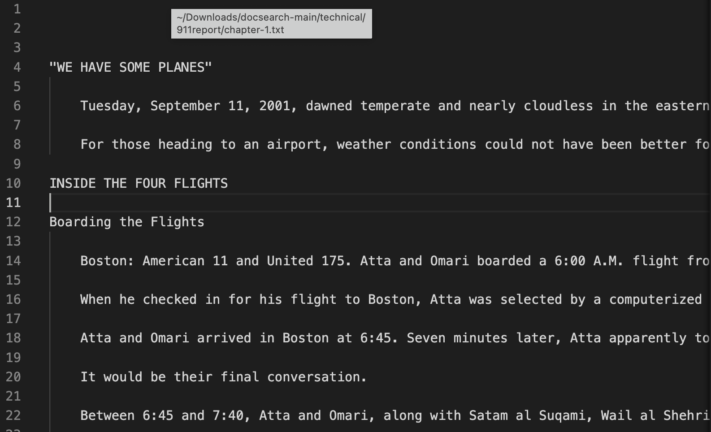
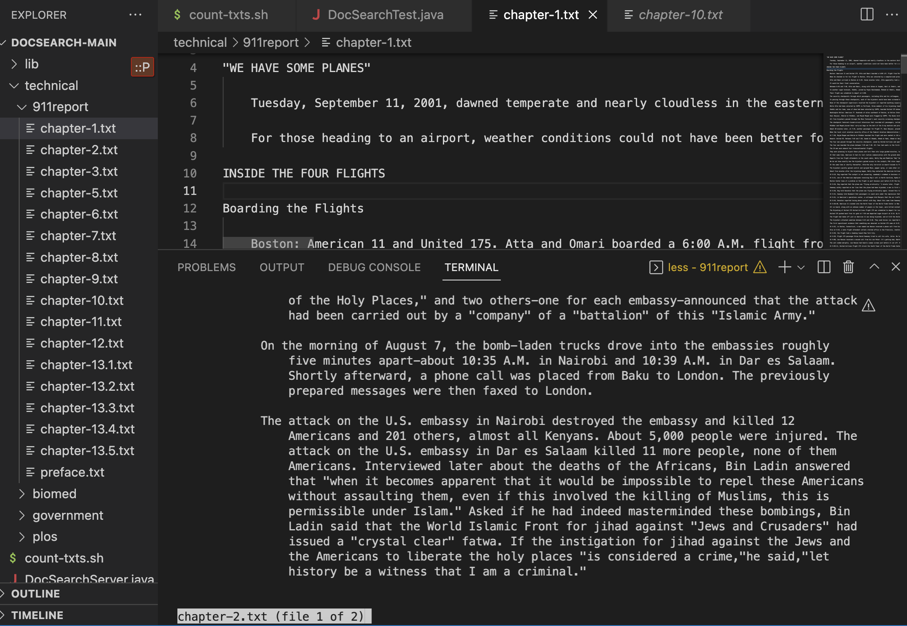
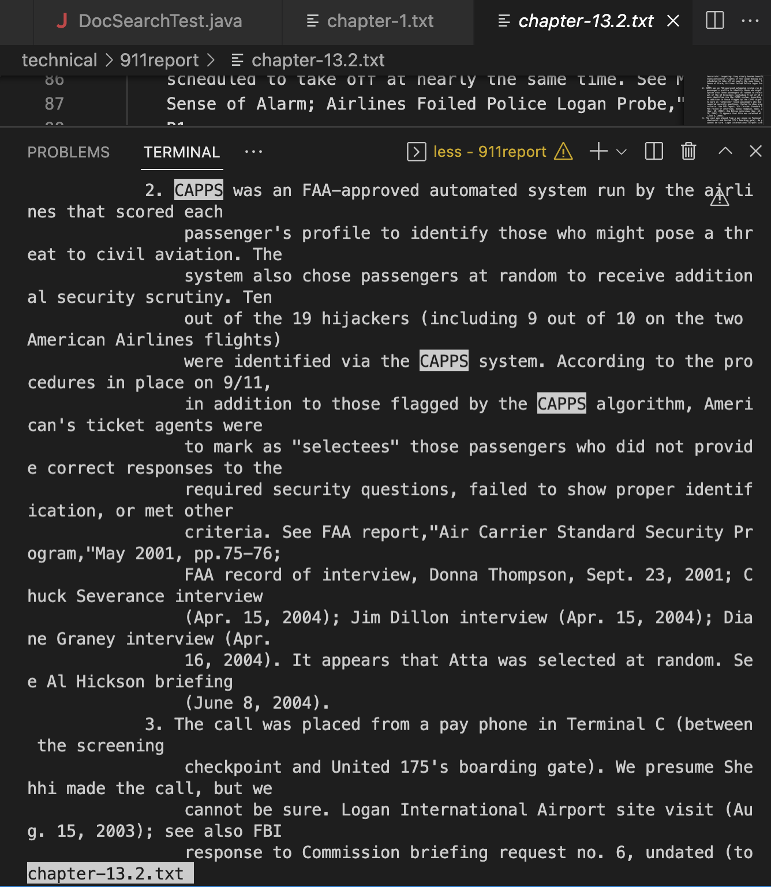

# CSE15L Lab Report 3- Command-Line Options

## **less** command options
1. **less -s < filename >** Merges consecutive blank lines into a single blank line.

For example:



*Input*
`less -s chapter-1.txt` 

*Output*

```
"WE HAVE SOME PLANES"

    Tuesday, September 11, 2001, dawned temperate and nearly cloudless in the e
astern United States. Millions of men and women readied themselves for work. So
me made their way to the Twin Towers, the signature structures of the World Trade Center complex in New York City. Others went to Arlington, Virginia, to the Pentagon. Across the Potomac River, the United States Congress was back in session. At the other end of Pennsylvania Avenue, people began to line up for a White House tour. In Sarasota, Florida, President George W. Bush went for an early morning run. (...)
```

2. **less < filename1 > < filename2 >** This command lind will open miltiple files simultaneously without losing the current position in the files. To move to the next file press *:n* and to return to the previous file press *:p*.

*Input:*
`less chapter-2.txt chapter-10.txt`

*Output:*


3. **less -pCAPPS < filename >** This command line will find all items containing the "CAPPS" string in the file.

*Input:* 
`less -p"CAPPS" chapter-13.2.txt`

*Output:*


## **find** command options
1. **ind lib -name "*.jar" -ctime -365**  uses –ctime (which tests the created time of the file against a relative time or another file) to find all JAR files created in the past year in a directory named lib.

*Input:*
`ind lib -name "*.jar" -ctime -365`

```
lib/junit-4.13.2.jar
lib/hamcrest-core-1.3.jar
```

2. **find ./ -type f -size 0** Find empty files and directories.

**Input:**
`find ./ -type f -size 0`

**Output (after having added a text file names empty.txt in biomed folder):**

```
.//empty.txt
```

3. **find < directory name > -mtime -< number of days >** looks for the files in the directory typed which were modified within the last **n** days.

**Input:**
`find /Users/meiman/Downloads/docsearch-main -mtime -1`

**Output:**
```
/Users/meiman/Downloads/docsearch-main
/Users/meiman/Downloads/docsearch-main/.DS_Store
/Users/meiman/Downloads/docsearch-main/technical
/Users/meiman/Downloads/docsearch-main/technical/government
/Users/meiman/Downloads/docsearch-main/technical/government/.DS_Store
/Users/meiman/Downloads/docsearch-main/technical/.DS_Store
/Users/meiman/Downloads/docsearch-main/technical/biomed
/Users/meiman/Downloads/docsearch-main/technical/911report
/Users/meiman/Downloads/docsearch-main/technical/911report/chapter-1.txt
```

## **grep** command options

1. **grep -c "pattern" filename** counts that how many lines matches the given pattern/string

`grep -c "cancer" bcr458.txt`

```
64
```

2.  **grep -v -c "pattern" < filename >**find out how many lines that does not match the pattern (-v is added to invert match).

*Inut:*
`grep -v -c this bcr458.txt`

*Output:*
```
383
```

3. **grep -o -b "pattern" < filename >** shows the position where it matches the pattern in the file.

*Input:*
`grep -o -b "cancer" bcr458.txt`

*Output:*
```
365:cancer
496:cancer
906:cancer
1086:cancer
1468:cancer
1652:cancer
1839:cancer
1911:cancer
2198:cancer
2470:cancer
2677:cancer
2883:cancer
3156:cancer
4628:cancer
5295:cancer
5469:cancer
6546:cancer
6601:cancer
6946:cancer
7214:cancer
7408:cancer
8895:cancer
9051:cancer
9378:cancer
9822:cancer
10069:cancer
10267:cancer
10405:cancer
10566:cancer
10777:cancer
11610:cancer
12266:cancer
12418:cancer
12895:cancer
13187:cancer
13300:cancer
13519:cancer
13591:cancer
15363:cancer
15547:cancer
15985:cancer
16428:cancer
17235:cancer
17360:cancer
18085:cancer
18209:cancer
18359:cancer
18648:cancer
18848:cancer
19110:cancer
19816:cancer
20215:cancer
20298:cancer
20426:cancer
20555:cancer
20771:cancer
21017:cancer
21387:cancer
21569:cancer
21682:cancer
21856:cancer
21938:cancer
22345:cancer
22772:cancer
```